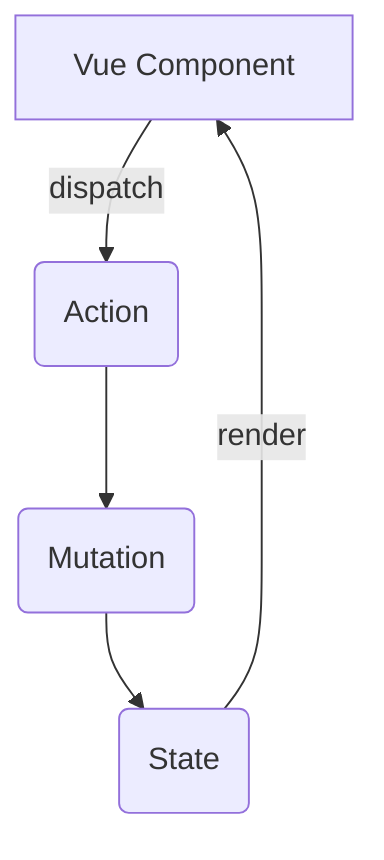


<!-- tab 核心概念 -->

```typescript Vue响应式原理
// 简化的响应式实现
class Dep {
  static target: Watcher | null
  subs: Watcher[] = []
  // ...实现依赖收集
}

class Watcher {
  // ...实现更新机制
}
```

<!-- endtab -->

<!-- tab 状态管理 -->

<!-- endtab -->
